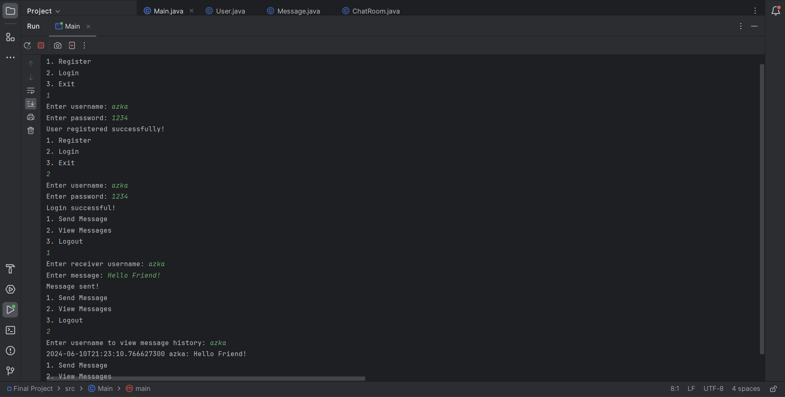

Azka Dwi Putra Azhad 2702357926

# Object-Oriented Programming Final Project

## Table of Contents
1. [Introduction](#introduction)
2. [Documentation](#documentation)
3. [The Application](#application)

## Introduction
This project is created within the Java programming language using Object-Oriented Programming. The goal of this project is to create a simple chat application that allows users to send and receive messages using a console-based interface. This allows for the practice of using Object-Oriented Programming concepts in coding.

## Documentation
This project has been documented in a report and a poster showing how the program functions:

- [PDF Report] : https://drive.google.com/drive/folders/1SsHjsgP9uMGNEcHYM50F-Ht9WuJvX5-8?usp=sharing
- [Poster] : https://drive.google.com/drive/folders/17smnEvEeQdrWZf4oSmlzU_lUHf06H6yj?usp=sharing

## Application 

